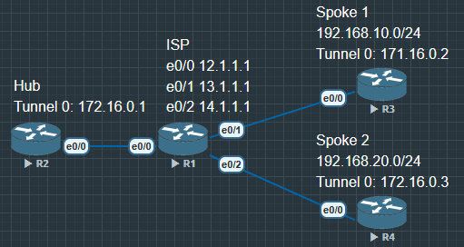

# DMVPN Phase 1 - Hub and Spoke

- DMVPN 的三大核心技术
    1. mGRE(Multipoint GRE)
    2. NHRP(Next Hop Resolution Protocol)
    3. IPsec

- Phase 1 模式特点与局限
    1. Hub and SPoke 星形拓扑结构
    2. 只有 Spoke 到 Hub 的隧道建立方向
    3. Hub 为 NHRP Server, Spoke 为 NHRP Client
    4. 最基础、最稳定的 DMVPN 形态(通常用于小型分支)


1. **DMVPN**

    Dynamic Multipoint VPN(动态多点虚拟专用网): 一种用 mGRE + NHRP(控制面) + 可选 IPsec(加密) + 路由协议或静态 构建的按需 可扩展的站点互联方案. 

2. NHRP 与 DMVPN 的关系?

    - NHRP 是 DMVPN 的"控制面大脑"：负责把Tunnel 地址 ↔ Underlay/NBMA 地址做映射、注册、解析和通知. 没有 NHRP, 就只有"普通 GRE", 无法在多点场景中自动找到对方, DMVPN 的"动态多点"就无从谈起. 


**DMVPN 的四块拼图(各司其职)**

1. mGRE(多点 GRE)— 数据"管道"形态
    - 让一个 Tunnel 接口同时对接多个对端(Hub 面向多 Spoke. Phase2/3 时 Spoke 也可 mGRE). 

2. NHRP(控制面)— "隧道的 ARP/电话簿"
    - Spoke 向 Hub(NHS)注册：我的 Tunnel=172.16.0.2, 对应 NBMA=13.1.1.2
    - Spoke 解析对端：172.16.0.3 的 NBMA 是谁? 
    - Hub 通知/中转 多播控制报文(配合 ip nhrp map multicast )
        - 让多点拓扑里"如何找到对方"自动化. 

3. (可选)IPsec — 安全外衣
    - GRE 本身不加密. 把 IPsec profile 绑在 Tunnel 上(常用 Transport 模式)实现加密与完整性保护. 

4. 路由/到达性 — 谁去哪里
    - 在 **覆盖网(Tunnel)**里用 EIGRP/OSPF/BGP 或静态 传播各站点 LAN 前缀. 
    - Underlay 只需要基本可达(缺省路由到 ISP 即可), 不承载你的私网路由. 


**"控制面 vs 数据面"一图流**

- 控制面(NHRP)：登记/解析/通知 → 决定"发往 172.16.0.X 应该封到哪个 NBMA". 
- 数据面(GRE / +IPsec)：真正承载流量的封装、转发与(可选)加密. 

    抓包角度：未加密时看到 GRE 明文. 启用 IPsec 后看到 ESP(或 UDP4500+ESP). 


**DMVPN 三个 Phase(为什么要分阶段)**

1. Phase 1(Hub-and-Spoke)
    - Hub=mGRE, Spoke=点到点 GRE. Spoke↔Spoke 必经 Hub. 最简单、好上手. 

2. Phase 2(Spoke-to-Spoke)
    - Spoke 也用 mGRE, 下一跳保持(NHB), Spoke 可直接建捷径隧道互通. 

3. Phase 3(现代常用)
    - 在 Phase2 基础上加 NHRP Redirect/Shortcut：Hub 先转一把, 然后引导 Spoke 走动态捷径. 收敛和扩展性最好. 


**如果只用 GRE, 不用 NHRP, 会怎样? **

- 你必须在每条隧道上手工配置 tunnel destination, Spoke 增长时极不方便. 
- 多播/控制面(EIGRP/OSPF)在 mGRE 里不好转发. 
    - Spoke↔Spoke 动态直连很难实现. 
        ⇒ DMVPN = 用 NHRP 把这些痛点一次性解决. 


**配置里的关键命令** 

1. mGRE / 多播转发(Hub)：
    tunnel mode gre multipoint、ip nhrp map multicast dynamic

2. NHRP 控制面(Spoke 指向 Hub)：
    ip nhrp nhs <Hub-Tunnel>、ip nhrp map <Hub-Tunnel> <Hub-NBMA>、ip nhrp map multicast <Hub-NBMA>

3. Phase1 路由传播(Hub 技巧)：
    no ip split-horizon eigrp <AS>

4. (可选)加密：
    tunnel protection ipsec profile <profile>


## 配置





**R2**

```
R2(config)#interface tunnel 0
R2(config-if)#ip address 172.16.0.1 255.255.255.0
R2(config-if)#tunnel source e0/0
R2(config-if)#tunnel mode gre multipoint 
// 把 Tunnel0 设为 mGRE(一对多)—— Hub 可同时面对多个 Spoke,而不是一对一

R2(config-if)#ip nhrp network-id 100
// 把 Tunnel0 设为 mGRE(一对多)——Hub 可同时面对多个 Spoke,而不是一对

R2(config-if)#ip nhrp map multicast dynamic
// 允许多播(EIGRP/OSPF 等)在 mGRE 上转发 并且动态学习每个 Spoke 的底层地址(无需手工一条条写)

R2(config-if)#ip nhrp authentication DMVPN
// 给 NHRP 加个口令 防止陌生 Spoke 乱入(Hub/Spoke 要一致)


R2(config)#router eigrp 100
R2(config-router)#network 172.16.0.0 0.0.0.255
R2(config-router)#passive-interface default
// 默认所有接口不发 EIGRP 邻居(安全/干净)

R2(config-router)#no passive-interface tunnel 0
// 只在 Tunnel0 上发 EIGRP 邻居与路由更新


R2(config)#int tunnel 0
R2(config-if)#no ip split-horizon eigrp 100
// 关闭分裂视界
    作用：Hub 能把从 Spoke1 学到的路由再转发给 Spoke2(否则 EIGRP 认为"不把从这个接口学到的前缀再从这个接口发出去" 导致 Spoke 之间看不到彼此 LAN)
```


**R3**

```
R3(config)#int tunnel 0
R3(config-if)#ip address 172.16.0.2 255.255.255.0
R3(config-if)#tunnel source e0/0
R3(config-if)#tunnel destination 12.1.1.2
R3(config-if)#ip nhrp network-id 100
R3(config-if)#ip nhrp nhs 172.16.0.1
R3(config-if)#ip nhrp map 172.16.0.1 12.1.1.2
R3(config-if)#ip nhrp map multicast 12.1.1.2
R3(config-if)#ip nhrp authentication DMVPN

R3(config)#router eigrp 100
R3(config-router)#network 172.16.0.0 0.0.0.255
R3(config-router)#network 192.168.10.0 0.0.0.255
R3(config-router)#passive-interface default
R3(config-router)#no passive-interface tunnel 0
```


**R4**

```
R4(config)#int tunnel 0
R4(config-if)#ip address 172.16.0.3 255.255.255.0
R4(config-if)#tunnel source e0/0
R4(config-if)#tunnel destination 12.1.1.2
R4(config-if)#ip nhrp network-id 100
R4(config-if)#ip nhrp nhs 172.16.0.1
R4(config-if)#ip nhrp map 172.16.0.1 12.1.1.2
R4(config-if)#ip nhrp map multicast 12.1.1.2
R4(config-if)#ip nhrp authentication DMVPN

R4(config)#router eigrp 100
R4(config-router)#network 172.16.0.0 0.0.0.255
R4(config-router)#network 192.168.20.0 0.0.0.255
R4(config-router)#passive-interface default
R4(config-router)#no passive-interface tunnel 0
```


### Hub(R2) - Tunnel 与 NHRP


NHRP(Next Hop Resolution Protocol) 下一跳解析协议

- 接口与模式
    1. `interface tunnel 0`：创建一条"覆盖网"隧道接口. 
    2. `ip address 172.16.0.1 255.255.255.0`：给隧道口分配"覆盖网"IP(所有站点在这个网段里互通). 
    3. `tunnel source e0/0`：隧道从哪块物理口发包(Underlay 出口). 
    4. `tunnel mode gre multipoint`：把 Tunnel0 设为 mGRE(一对多)——Hub 可同时面对多个 Spoke, 而不是一对一. 

- NHRP(控制面：谁是谁、在哪)
    1. `ip nhrp network-id 100`：给本 DMVPN 域一个编号. Hub/Spoke 得一致才能互认. 
    2. `ip nhrp map multicast dynamic`：允许多播(EIGRP/OSPF 等)在 mGRE 上转发, 并且动态学习每个 Spoke 的底层地址(无需手工一条条写). 
    3. `ip nhrp authentication DMVPN`：给 NHRP 加个口令, 防止陌生 Spoke 乱入(Hub/Spoke 要一致). 

- EIGRP(覆盖网里的路由)
    1. `router eigrp 100` + `network 172.16.0.0 0.0.0.255`：在隧道网 172.16.0.0/24 上跑 EIGRP, 负责发布/学习各站点 LAN 路由. 
    2. `passive-interface default`：默认所有接口不发 EIGRP 邻居(安全/干净). 
    3. `no passive-interface tunnel 0`：只在 Tunnel0 上发 EIGRP 邻居与路由更新. 

- 关键开关
    1. `no ip split-horizon eigrp 100`(在 int tun0 下)：关闭分裂视界. 
        - 作用：Hub 能把从 Spoke1 学到的路由再转发给 Spoke2(否则 EIGRP 认为"不把从这个接口学到的前缀再从这个接口发出去", 导致 Spoke 之间看不到彼此 LAN). 


#### Spokes(R3 / R4) — Tunnel NHRP 与 EIGRP


- 接口与模式
    1. interface tunnel 0 + ip address 172.16.0.2/3 255.255.255.0：为 Spoke 的隧道接口分配覆盖网 IP. 
    2. tunnel source e0/0：底层发包口. 
    3. tunnel destination 12.1.1.2：点到点 GRE对端的底层地址(Hub 的 e0/0). 
        - 在 Phase 1, 我们常用"Hub=mGRE、Spoke=点到点 GRE". Spoke 明确指向 Hub, 简单稳定. 

- NHRP(告诉自己"Hub 在哪")
    1. ip nhrp network-id 100：与 Hub 一致. 
    2. ip nhrp nhs 172.16.0.1：指定 NHRP 服务器(Hub 的 Tunnel IP). 
    3. ip nhrp map 172.16.0.1 12.1.1.2：告诉本地：Hub 的 Tunnel IP=172.16.0.1 对应的底层地址=12.1.1.2(这样发往 Hub 的隧道包才能封装到对的 NBMA). 
    4. ip nhrp map multicast 12.1.1.2：多播流量(如 EIGRP Hello/Update)也通过 Hub 的 NBMA 去封装转发. 
    5. ip nhrp authentication DMVPN：与 Hub 一致的口令. 

- EIGRP(覆盖网里的路由)
    1. router eigrp 100
    2. network 172.16.0.0 0.0.0.255：在隧道上跑邻居. 
    3. network 192.168.10.0/20.0 0.0.0.255：把各自 LAN 前缀通告进 EIGRP. 
    4. passive-interface default / no passive-interface tunnel 0：只在隧道上跑 EIGRP, 避免在物理口上泛洪. 

##### Underlay(底层)缺省路由(很重要)


- ip route 0.0.0.0 0.0.0.0 (ISP网关)
    1. R2：...  12.1.1.1
    2. R3：...  13.1.1.1
    3. R4：...  14.1.1.1


**目的**：保证底层一定能到达 Hub/Spoke 的 NBMA 地址(比如 R3 必须能到 12.1.1.2)

    没有这条, 隧道包都发不出去(NHRP/EIGRP 自然也起不来). 


**整体工作流(打通脑回路)**


1. 隧道建立
    - Spoke 知道 Hub 的 NBMA(tunnel destination + NHRP map) 所以能把发往 Tunnel 的包封成 GRE 底层发给 12.1.1.2
    - Hub 是 mGRE 可同时收多条 Spoke 的 GRE 流

2. 邻居与路由(控制面)
    - EIGRP 的 Hello/Update 是多播 靠 ip nhrp map multicast ...  在 mGRE 上转发
    - Hub 关闭 split-horizon 后 能把 Spoke1 学到的 192.168.10.0/24 转发给 Spoke2 反之亦然

3. 数据转发(数据面)
    - R3 发去 192.168.20.0/24 → 由 EIGRP 学到"下一跳=Hub 的 172.16.0.1"→ GRE 封装发给 Hub(12.1.1.2) → Hub 再转给 R4
    - Phase 1 特性：Spoke↔Spoke 必经 Hub(没有直连隧道"捷径")


###### 后记

1. 为什么 Hub 要 mGRE 但是Spoke 不用? 
    Hub 面对多 Spoke 天然一对多. Spoke 只需面对 Hub 一个对端即可 所以用点到点 GRE 简洁可靠


2. 为什么要关 split-horizon?
    因为所有 Spoke 路由都是从"同一个接口(Tunnel0)"进来. 默认 EIGRP 不把它再从同一个接口发出去. 关掉后 Hub 才能把 Spoke1 的前缀转发给 Spoke2

3. 为什么要 `map multicast`?
    EIGRP/OSPF 使用多播地址发送 Hello/LSA 等. 没有多播映射 控制报文过不去 邻居建不起来

4. ISP 需要跑我的路由协议吗?
    不需要 ISP 只承载 Underlay 的 IP 连通. 你的站点 LAN 路由在 **Overlay(Tunnel)**里解决(EIGRP/静态/eBGP 都行)


**最小化的"必不可少清单"**


- Hub: `tunnel mode gre multipoint` + `ip nhrp map multicast dynamic` + `no ip split-horizon eigrp ... `

- Spoke: `tunnel destination <Hub-NBMA>` + `ip nhrp nhs` / `ip nhrp map` / `ip nhrp map multicast`

- 三端：Underlay 缺省路由. Tunnel 与相关接口 `no shut`

- 覆盖网：在 Tunnel 上跑 IGP(或改成静态路由也行)


**验证**


1. `show ip nhrp`

```
R2#show ip nhrp
172.16.0.2/32 via 172.16.0.2
   Tunnel0 created 01:45:11 expire 00:09:53
   Type: dynamic Flags: registered nhop
   NBMA address: 13.1.1.3
172.16.0.3/32 via 172.16.0.3
   Tunnel0 created 01:39:55 expire 00:08:12
   Type: dynamic Flags: registered nhop
   NBMA address: 14.1.1.4
```


2. `show dmvpn`

```
R2#show dmvpn
Legend: Attrb --> S - Static D - Dynamic I - Incomplete
        N - NATed L - Local X - No Socket
        T1 - Route Installed T2 - Nexthop-override
        C - CTS Capable I2 - Temporary
        # Ent --> Number of NHRP entries with same NBMA peer
        NHS Status: E --> Expecting Replies R --> Responding W --> Waiting
        UpDn Time --> Up or Down Time for a Tunnel
==========================================================================

Interface: Tunnel0 IPv4 NHRP Details
Type:Hub NHRP Peers:2,

 # Ent  Peer NBMA Addr Peer Tunnel Add State  UpDn Tm Attrb
 ----- --------------- --------------- ----- -------- -----
     1 13.1.1.3             172.16.0.2    UP 01:46:15     D
     1 14.1.1.4             172.16.0.3    UP 01:41:12     D
```