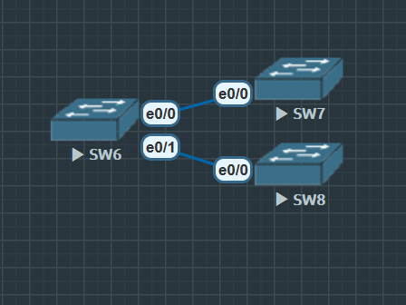

# VTP（VLAN Trunking Protocol）

**Cisco专有**协议，用于在同一VTP域内的交换机之间管理和分发VLAN信息。

VTP协议简化了VLAN的配置和管理，确保网络中所有交换机的一致性。

## VTP 作用

1. 集中管理VLAN配置
    - VTP允许网络管理员在一个中心点（通常是VTP服务器）上创建、删除或重命名VLAN，然后将这些更改分发到网络中的所有交换机。

2. 减少配置错误:
    - 通过自动传播VLAN信息，减少了手动配置带来的错误和不一致性

3. 简化网络扩展:
    - 当新的交换机加入网络时，VTP可以自动将现有的VLAN信息分发到新交换机上，无需手动配置。

### VTP 详情

使用 `show vtp status` 命令检查 VTP 状态

```
SW6#show vtp status
VTP Version capable             : 1 to 3
VTP version running             : 1
// VTP 版本1
VTP Domain Name                 :
// 没有VTP
VTP Pruning Mode                : Disabled
VTP Traps Generation            : Disabled
Device ID                       : aabb.cc80.6000
Configuration last modified by 0.0.0.0 at 0-0-00 00:00:00
Local updater ID is 0.0.0.0 (no valid interface found)

Feature VLAN:
--------------
VTP Operating Mode                : Server
// 默认服务模式
Maximum VLANs supported locally   : 1005
Number of existing VLANs          : 5
Configuration Revision            : 0
// 没有修改
MD5 digest                        : 0x57 0xCD 0x40 0x65 0x63 0x59 0x47 0xBD
                                    0x56 0x9D 0x4A 0x3E 0xA5 0x69 0x35 0xBC
```

1. `vtp version <1-3>` 修改版本
    - 只有 v3 能同步扩展 VLAN
    - v1, v2 密码为明文, v3 加密
    - v3 引入 Primary Server, 只有 Primary Server 才相当于 v1, v2 的 Serer, `vtp primary`

2. **VTP Domain Name**
    - 必须在同一个 Domain 后才能同步 VLAN 信息

3. **Operating Mode**
    1) Server
        - 交换机可以**创建, 修改, 删除 VLAN**, 并将这些更改同步给 VTP Domian 中的所有交换机
        - 每个 VTP Domian 至少需要一台 VTP Server, 确保 VLAN 信息的传播

    2) Client
        - 交换机无法**创建, 修改,删除 VLAN**, 只能同步来自 VTP Server 的 VLAN 信息
        - Mode Client 确保网络中所有交换机都有一致的 VLAN 信息

    3) Transparent
        - 交换机不会参与 VTP Domian 的信息同步, 但会转发收到的 VTP 消息
        - 可以配置本地 VLAN, 但是不会被同步到其他交换机

4. VLAN 的储存
    - 1-1005    (标准 VLAN)储存在 running-config
    - 1006-4095 (扩展 VLAN)储存在 vlan.dat 查看命令 `dir` 

5. VLAN 完全清除
    - 命令 `delete vlan.dat` , 之后 `reload`
    
#### VTP 配置



**SW7**

```
SW7(config)#int e0/0
SW7(config-if)#switchport trunk encapsulation dot1q
SW7(config-if)#switchport mode trunk
```

**SW8**

```
SW8(config)#int e0/0
SW8(config-if)#switchport trunk encapsulation dot1q
SW8(config-if)#switchport mode trunk
```

**SW6**

```
SW6(config)#interface range ethernet 0/0-1
SW6(config-if-range)#switchport trunk encapsulation dot1q
SW6(config-if-range)#switchport mode trunk

SW6(config)#vtp domain AD
Changing VTP domain name from NULL to AD
// 创建 VTP 后, 交换机会自动将 VTP Domian 同步到所有的 Trunk 链路中的其他交换机

SW6(config)#vtp mode server
Device mode already VTP Server for VLANS.
```

**SW7**

```
SW7(config)#vtp domain AD
Domain name already set to AD.
// 可以看到已经存在之前设置好的 VTP Domain

SW7(config)#vtp mode client
Setting device to VTP Client mode for VLANS.
```

这个时候可以在 Server 交换机上创建 VLAN, 这些 VLAN 会自动同步到同 Domian 中的交换机上.

