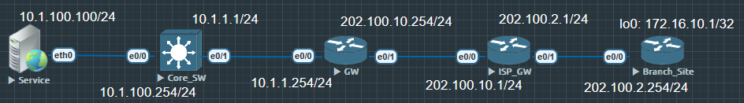

多数情况下组织和机构使用VPN是为了省钱, 但是VPN会带来一些问题, 如安全(Data Security), 带宽保证(Lack of Dedicated Bandwidth Sites)

VPN分为两种模型
1. 站点到站点 - L2L site to site
2. 远程访问 - remote access

站点到站点 - L2L site to site:
- ATM
- Fram Relay
- *GRE*
- MPLS VPN
- IPSec

远程访问 Remote
- IPSec
- PPTP
- LTP + IPSec
- SSLVPN

# GRE Generic Routing ENcapsulation 通用路由封装协议

GRE Tunnel, 是一个由思科开发的隧道协议, 类似于IP in IP的隧道协议可以把一个网络协议封装在另外一个网络协议中。根据RFC 2784定义：外层的协议我们成为deliver protocol（传输协议）它把内层的协议 Payload（载荷）封装在里面。因为较为简单且实施方便，相比其他隧道协议有很强的通用性，甚至能透过GRE tunnel 传送 multicast和 IPv6等信息。

```
0               7               15              23              31
+---------------+---------------+---------------+---------------+
|C|R|K|S|s| Recur/Reserved |      Flags/Reserved     |  Version |
+---------------+---------------+---------------+---------------+
|                Protocol Type (上层协议以太类型)              |
+---------------+---------------+---------------+---------------+
[ Checksum (16) ][ Reserved1 (16) ]          (若 C=1 才有)
[ Key (32) ]                                 (若 K=1 才有)
[ Sequence Number (32) ]                      (若 S=1 才有)
[ Routing (可变) ]                            (若 R=1 才有)
```

## GRE 配置

首先要明白VPN不是超脱网络规则的东西，也是必须有可达路由才能使用VPN连接，简单点设置环境就是把GW，ISP_GW，Branch_Site 都宣告进OSPF，在Core_SW 上写一条静态0.0.0.0 0.0.0.0 10.1.1.254，在GW也写一条静态10.1.0.0 255.255.0.0 10.1.1.1，把GW上的静态路由重分布进OSPF redistribute static...  不把lo0重分布进ospf



首先需要一条路由从GW到Branch_Site的172.16.10.1

```
GW(config)#ip route 172.16.10.1 255.255.255.255 192.168.1.1
```

配置所需要的隧道, 这里给GW配置的隧道地址是192.168.1.2, Branch_Site的隧道地址是192.168.1.1

```
GW(config)#int tunnel 100
GW(config-if)#ip address 192.168.1.2 255.255.255.0
GW(config-if)#tunnel source 202.100.10.254
GW(config-if)#tunnel destination 202.100.2.254
```

在Branch_Site需要同样类似的配置, 需要一条返程路由

```
Branch_Site(config)#ip route 10.1.0.0 255.255.0.0 192.168.1.2
```

同样配置一条隧道

```
Branch_Site(config)#int tunnel 100
Branch_Site(config-if)#ip add 192.168.1.1 255.255.255.255
Branch_Site(config-if)#no shu
Branch_Site(config-if)#tunnel source 202.100.2.254
Branch_Site(config-if)#tunnel destination 202.100.10.254
```

整个GRE隧道配置完成, 这时候在Service端可以访问到172.16.10.1整个地址

```
Service> ping 172.16.10.1

84 bytes from 172.16.10.1 icmp_seq=1 ttl=252 time=1.159 ms
84 bytes from 172.16.10.1 icmp_seq=2 ttl=252 time=0.838 ms
84 bytes from 172.16.10.1 icmp_seq=3 ttl=252 time=1.239 ms
84 bytes from 172.16.10.1 icmp_seq=4 ttl=252 time=1.160 ms
84 bytes from 172.16.10.1 icmp_seq=5 ttl=252 time=0.723 ms
```

在配置隧道时需要务必注意, `tunnel destination` 必须是现实环境中可达的, 有真实路由存在的一个目的地.